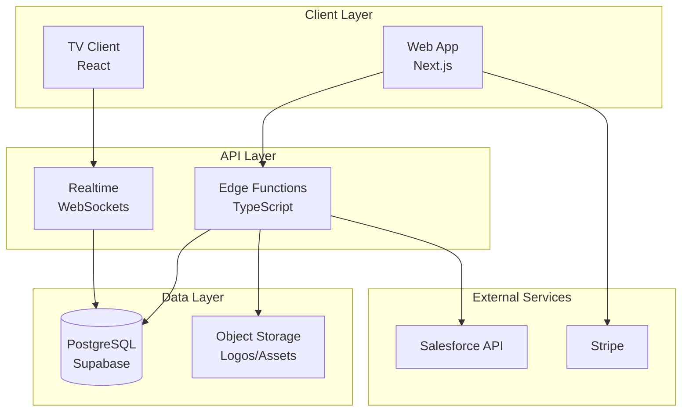

# SFTV – Complete Product Requirements Document

> **Version**: 1.0  
> **Last Updated**: June 2025  
> **Status**: Ready for Implementation

---

## 📋 Table of Contents

1. [Executive Summary](#1-executive-summary)
2. [Product Overview](#2-product-overview)
3. [Market & User Analysis](#3-market--user-analysis)
4. [Product Requirements](#4-product-requirements)
5. [Technical Architecture](#5-technical-architecture)
6. [User Stories & Acceptance Criteria](#6-user-stories--acceptance-criteria)
7. [Data Model & API Contracts](#7-data-model--api-contracts)
8. [UI/UX Specifications](#8-uiux-specifications)
9. [Implementation Roadmap](#9-implementation-roadmap)
10. [Quality & Testing Strategy](#10-quality--testing-strategy)
11. [Security & Compliance](#11-security--compliance)
12. [Operational Excellence](#12-operational-excellence)
13. [Success Metrics & Analytics](#13-success-metrics--analytics)
14. [Risk Management](#14-risk-management)
15. [Appendices](#15-appendices)
16. [Document Control](#16-document-control)

---

## 1. Executive Summary

### Vision Statement
SFTV delivers real-time, TV-friendly visibility into Salesforce dashboards for RevOps and Sales teams — all within 5 minutes of freshness, no data warehousing required.

### Problem Statement
Revenue teams struggle to surface live Salesforce insights on shared displays. Existing solutions require manual exports, complex BI tools, or lack visual polish. SFTV fills this gap with a live, branded, install-once experience.

### Key Benefits
- **5-minute setup**: Connect Salesforce → Display on TV
- **Real-time updates**: Sub-30-second data freshness
- **Zero maintenance**: Auto-rotating, always-on dashboards
- **Professional branding**: Custom colors and logos
- **Enterprise-ready**: Secure, scalable, observable

### Success Metrics (90-day targets)
- 50+ connected Salesforce orgs
- 200+ TVs activated
- ≥25% conversion free → paid
- ≤3 support tickets/org in first month
- 99.9% uptime SLA

---

## 2. Product Overview

### Product Description
SFTV is a SaaS platform that transforms Salesforce Lightning dashboards into beautiful, real-time TV displays. It consists of:
- **Web Application**: Dashboard management and configuration
- **TV Client**: Optimized renderer for display devices
- **Edge Functions**: Secure Salesforce data ingestion pipeline
- **Realtime Infrastructure**: Live updates via WebSockets

### Core Features
1. **Salesforce Integration**: OAuth-based secure connection
2. **Dashboard Ingestion**: Automatic widget extraction and theming
3. **TV Pairing**: PIN-based device onboarding
4. **Slideshow Management**: Multi-dashboard rotation
5. **Custom Branding**: Logo and color theming
6. **Team Management**: Role-based access control
7. **Premium Features**: Advanced theming, priority support

### Pricing Tiers
| Tier | Price | Features |
|------|-------|----------|
| **Free** | $0/mo | 1 TV, SFTV watermark, 5 dashboards |
| **Premium** | $49.99/mo | Unlimited TVs, custom branding, priority refresh |
| **Enterprise** | Custom | SLA, SSO, dedicated support |

---

## 3. Market & User Analysis

### Target Personas

#### Primary: RevOps Lead
- **Goals**: Surface KPIs, track performance trends
- **Pain Points**: Manual exports, outdated reports, complex tools
- **Jobs to be Done**: Display real-time metrics, motivate teams
- **Success Criteria**: Zero-maintenance visibility

#### Secondary: Office IT Admin
- **Goals**: Simple TV setup, reliable operation
- **Pain Points**: Complex provisioning, token expiry
- **Jobs to be Done**: Deploy dashboards, manage devices
- **Success Criteria**: Set-and-forget installation

#### Tertiary: Sales Director
- **Goals**: Motivate team, highlight achievements
- **Pain Points**: Visual noise, laggy data, poor branding
- **Jobs to be Done**: Showcase wins, drive competition
- **Success Criteria**: Beautiful, current displays

### Market Opportunity
- **TAM**: 150,000+ Salesforce customers globally
- **SAM**: 30,000+ mid-market & enterprise orgs
- **SOM**: 3,000 orgs (10% penetration in 3 years)

---

## 4. Product Requirements

### Functional Requirements

#### FR1: Authentication & Authorization
- Email/password authentication
- Google OAuth (Phase 2)
- Role-based access (Admin, Member)
- Session management with 8-hour JWT expiry
- Password reset via email

#### FR2: Salesforce Integration
- OAuth 2.0 connected app flow
- Public dashboard discovery
- User avatar synchronization
- Automatic token refresh
- API quota monitoring (Phase 2)

#### FR3: Dashboard Management
- List all public Salesforce dashboards
- Filter by folder
- Search by name
- Manual refresh trigger
- Preview before adding

#### FR4: TV Client Features
- PIN-based pairing (AA-99-AA format)
- Auto-rotating slideshows
- Configurable intervals (15s - 5min)
- Smooth transitions
- Offline resilience

#### FR5: Widget Rendering
- Support for core Lightning components
- Dynamic theming
- TV-optimized layouts
- Avatar integration
- Fallback for unsupported types

#### FR6: Billing & Subscriptions
- Stripe integration
- Monthly subscriptions
- Plan upgrades/downgrades
- Invoice management
- Payment method updates

### Non-Functional Requirements

#### Performance
- Dashboard ingest latency: ≤500ms P95
- Realtime broadcast delay: ≤100ms P95
- TV client FPS: ≥55fps @ 1080p
- Concurrent TVs per org: 20 (tested)
- JSON transform + cache: <1s P95 per dashboard
- Frame-drop: ≤2% on 1080p TV with 6 widgets
- Memory budget: TV client heap ≤150MB under full load

#### Scalability
- 10,000 concurrent TVs globally
- 1M dashboard renders/day
- Auto-scaling Edge Functions
- CDN-backed assets

#### Reliability
- 99.9% uptime SLA
- Automatic failover
- Graceful degradation
- Circuit breakers

#### Security
- SOC 2 Type I compliance path
- End-to-end encryption
- Row-level security (RLS)
- No PII storage
- 30-day data retention

---

## 5. Technical Architecture

### Technology Stack

#### Frontend
- **Framework**: Next.js 14 (App Router)
- **UI Library**: React 18
- **Styling**: Tailwind CSS
- **Charts**: Recharts
- **State**: Zustand
- **Language**: TypeScript 5.0

#### Backend
- **Runtime**: Node.js 20 LTS
- **Edge Functions**: Supabase Functions (Deno)
- **Database**: PostgreSQL 15 (Supabase)
- **Realtime**: Supabase Realtime
- **Cache**: In-memory (30s TTL)

#### Infrastructure
- **Hosting**: Vercel (frontend), Supabase Cloud (backend)
- **CDN**: Vercel Edge Network
- **Monitoring**: Supabase Analytics, Sentry
- **CI/CD**: GitHub Actions

### System Architecture



### Data Flow

1. **Dashboard Ingestion**
   ```
   Salesforce API → Edge Function → Transform → Cache → Broadcast
   ```

2. **TV Display Pipeline**
   ```
   TV Client → WebSocket → Realtime → Dashboard Data → Render
   ```

3. **User Management**
   ```
   Web App → Auth → RLS → Database → Response
   ```

---

## 6. User Stories & Acceptance Criteria

This section contains all user stories organized into 10 epics (A through J), each with detailed acceptance criteria, priority levels, and story point estimates.

### Epic A: PIN Pairing & TV Onboarding

| ID | User Story | Priority | Points |
|----|------------|----------|--------|
| A-1 | As an Admin, I see a PIN + QR when TV boots | M | 3 |
| A-2 | As an Admin, I can claim a TV via PIN from my phone | M | 3 |
| A-3 | As a System, PINs expire after 10 minutes | M | 2 |
| A-4 | As an Admin, I can rename or delete TVs from the UI | S | 2 |

**Acceptance Criteria for A-1:**
- [ ] PIN format is AA-99-AA (e.g., XY-42-AB) where A = letter, 9 = number
- [ ] QR code contains pairing URL with PIN embedded
- [ ] Display appears within 2 seconds of boot
- [ ] Font size readable from 10 feet away
- [ ] PIN and QR code centered on screen with SFTV branding
- [ ] Screen shows "Ready to pair" message

**Acceptance Criteria for A-2:**
- [ ] PIN validation happens server-side
- [ ] Success redirects to TV naming screen
- [ ] Error shows clear message for invalid/expired PIN
- [ ] Mobile-optimized UI

**Acceptance Criteria for A-3:**
- [ ] PIN expires exactly 10 minutes after generation
- [ ] Expired PINs return 4002 error code
- [ ] TV automatically generates new PIN after expiry

**Acceptance Criteria for A-4:**
- [ ] Name limited to 32 characters
- [ ] Delete requires confirmation modal
- [ ] Changes reflect immediately via Realtime
- [ ] Deleted TV returns to pairing screen

### Epic B: Multi-Dashboard Rotation

| ID | User Story | Priority | Points |
|----|------------|----------|--------|
| B-1 | As a User, I can select multiple dashboards and rotation interval | M | 3 |
| B-2 | As a Viewer, dashboards rotate smoothly | M | 5 |
| B-3 | As a User, I can change rotation settings live | S | 2 |

**Acceptance Criteria for B-1:**
- [ ] Multi-select checkbox UI for dashboards
- [ ] Interval slider from 15s to 5 min
- [ ] Minimum 10s enforced
- [ ] Save updates slideshow immediately

**Acceptance Criteria for B-2:**
- [ ] Next dashboard preloads during current display
- [ ] Transition animation completes in <300ms
- [ ] No flicker, flash, or blank screens between dashboards
- [ ] Memory usage remains stable over 24-hour period
- [ ] Smooth fade or slide transition effect
- [ ] Loading indicator if next dashboard not ready

**Acceptance Criteria for B-3:**
- [ ] Changes propagate via Realtime in <100ms
- [ ] No interruption to current display
- [ ] Settings persist across TV restarts

### Epic C: Salesforce API Quota Guardrails (Phase 2)

| ID | User Story | Priority | Points |
|----|------------|----------|--------|
| C-1 | As a System, I check API quota every 5 min | C | 3 |
| C-2 | As a System, I pause refresh when quota is low | C | 3 |
| C-3 | As an Admin, I get alerts when quota breached | C | 2 |
| C-4 | As an Admin, I can override quota pause for 1hr | C | 2 |

### Epic D: Widget Renderer & Theming

| ID | User Story | Priority | Points |
|----|------------|----------|--------|
| D-1 | As a Viewer, I want widgets to be TV-friendly | M | 5 |
| D-2 | As a Developer, I need clean JSON → Component contract | M | 3 |
| D-3 | As a System, unknown widget types trigger fallback | M | 2 |
| D-4 | As a Viewer, I want org-branded dashboards | M | 3 |
| D-5 | As a Viewer, I want widgets to fill 100% of TV space | M | 3 |
| D-6 | As a Viewer, I see user avatars in tables and charts | S | 3 |

**Acceptance Criteria for D-1:**
- [ ] Widget displays title and subtitle if present
- [ ] Chart legends are hidden to reduce clutter
- [ ] Fonts use clamp() sizing
- [ ] No horizontal scroll

**Acceptance Criteria for D-2:**
- [ ] WidgetHost dynamically imports from widgets/<type>.tsx
- [ ] Unknown types route to fallback component
- [ ] Component props match {data, title}

**Acceptance Criteria for D-3:**
- [ ] Renderer shows "Unsupported widget" notice
- [ ] Error logged in widget_errors table with type + dashboard ID

#### D-4 Theming Requirements
**Acceptance Criteria for D-4:**
- [ ] Free plan: SFTV logo bottom-right
- [ ] Premium: org logo replaces watermark
- [ ] PrimaryColor (#8034BF) = chart fill accents, buttons, links
- [ ] SecondaryColor (#1C1E20) = dark UI base, navigation bars

**Acceptance Criteria for D-5:**
- [ ] 4% margin for overscan
- [ ] Grid layout fills 95% viewport using pre-built layout recipes
- [ ] Grid chosen based on widget count (1, 2, 4, 6, etc.)
- [ ] Blank space triggers console warning

**Acceptance Criteria for D-6:**
- [ ] Avatars shown left of name (tables)
- [ ] 24px avatar overlaid beside bar label (charts)
- [ ] Missing = colored circle with initials
- [ ] Data pulled from sf_users avatar URL map

### Epic E: Observability & Alerting

| ID | User Story | Priority | Points |
|----|------------|----------|--------|
| E-1 | As Support, I see real-time metrics per TV | M | 3 |
| E-2 | As a System, I alert if TV offline >10 min | M | 2 |
| E-3 | As a PM, I can query key product metrics | S | 3 |
| E-4 | As On-call, I get alerted on error spikes | M | 2 |

**Acceptance Criteria for E-1:**
- [ ] FPS, latency, errors reported to tv_metrics via buffered POST every 30s
- [ ] Supabase dashboard or internal Grafana panel

**Acceptance Criteria for E-2:**
- [ ] Slack webhook includes TV name, last check-in

**Acceptance Criteria for E-3:**
- [ ] Supabase analytic views show: active TVs/orgs, conversion rate
- [ ] Views update daily

**Acceptance Criteria for E-4:**
- [ ] PagerDuty alert triggers if Edge Function error-rate >2% in last 5 min
- [ ] Suppressed outside business hours unless severity = high

### Epic F: Core Web UX & Account Management

| ID | User Story | Priority | Points |
|----|------------|----------|--------|
| F-1 | As a Visitor, I see Sign-Up and Sign-In buttons | M | 1 |
| F-2 | As a Visitor, I can register via email/password | M | 3 |
| F-3 | As a User, I can sign in with email/password | M | 2 |
| F-4 | As a User, I can sign out | M | 1 |
| F-5 | As a User, I can edit profile + upload avatar | S | 2 |
| F-6 | As a User, I can request password reset | M | 2 |
| F-7 | As a Visitor, I can sign up using Google (Phase 2) | C | 3 |
| F-8 | As a User, I can change password while logged in | S | 2 |
| F-9 | As a User, protected routes redirect if session lost | M | 2 |
| F-10 | As a System, I auto-create "Default Slideshow" on signup | M | 2 |

**Acceptance Criteria for F-2:**
- [ ] Fields: first name, last name, email, password x2
- [ ] Validation + error messages
- [ ] Auto-login on success
- [ ] Redirect to /app/settings/integrations

**Acceptance Criteria for F-3:**
- [ ] Email + password validated server-side
- [ ] Error toast for invalid creds
- [ ] "Remember me" checkbox keeps session 7 days

**Acceptance Criteria for F-5:**
- [ ] Edit: first, last, email
- [ ] Avatar: JPG/PNG ≤2MB with preview
- [ ] Save / Cancel inline

**Acceptance Criteria for F-6:**
- [ ] "Forgot password?" → form → email sent with 60 min reset link
- [ ] Link = one-time use

**Acceptance Criteria for F-9:**
- [ ] Visiting /app/... without session sends user to /login

**Acceptance Criteria for F-10:**
- [ ] New orgs have 1 default slideshow preloaded
- [ ] Dashboards added here by default if no slideshow selected

### Epic G: Navigation Bar & Settings

| ID | User Story | Priority | Points |
|----|------------|----------|--------|
| G-1 | As a User, I see vertical nav with logo and settings | M | 2 |
| G-2 | As a User, I can switch between settings tabs | M | 2 |
| G-3 | As an Admin, I can customize company branding | M | 3 |
| G-4 | As an Admin, I can connect/disconnect Salesforce | M | 3 |
| G-5 | As an Admin, I can view and upgrade plans | M | 3 |
| G-6 | As an Admin, I can downgrade or cancel | S | 2 |
| G-7 | As an Admin, I can download invoices | S | 2 |
| G-8 | As an Admin, I can update payment method | M | 2 |

**Acceptance Criteria for G-1:**
- [ ] Logo routes to /app/dashboard
- [ ] Nav collapses to icons on screens ≤1024px
- [ ] Active item is highlighted

**Acceptance Criteria for G-2:**
- [ ] Tabs load their content on click
- [ ] Active tab is visually highlighted

**Acceptance Criteria for G-3:**
- [ ] Logo upload with live preview
- [ ] Hex-color inputs validate format
- [ ] Team section lists members with roles and provides an Invite button
- [ ] Action icons to disable, resend, or revoke invites

**Acceptance Criteria for G-4:**
- [ ] "Connect" opens OAuth flow; "Disconnect" revokes token
- [ ] Disconnect warns about stopped dashboard updates

**Acceptance Criteria for G-5:**
- [ ] Displays plan badge (Free / Premium)
- [ ] "Upgrade" opens Stripe Checkout for $49.99/mo
- [ ] Post-checkout webhook updates plan status

**Acceptance Criteria for G-6:**
- [ ] "Downgrade/Cancel" opens confirmation modal
- [ ] Downgrade handled prorata
- [ ] Action recorded in audit log

**Acceptance Criteria for G-7:**
- [ ] Invoice list shows date, amount, status, "Download PDF" link
- [ ] Only invoices for the company are shown

**Acceptance Criteria for G-8:**
- [ ] "Update Payment Method" launches Stripe Customer Portal
- [ ] On portal close, Plans page auto-refreshes

### Epic H: Dashboards, Slideshows & TVs

| ID | User Story | Priority | Points |
|----|------------|----------|--------|
| H-1 | As a User, I can view all public dashboards in a table | M | 3 |
| H-2 | As a User, I can manage TVs from a table | M | 3 |
| H-3 | As a User, I can create a new slideshow | M | 3 |
| H-4 | As a User, I can create public share URL (Phase 2) | C | 3 |
| H-5 | As an Admin, I can delete TV or slideshow | M | 2 |
| H-6 | As a User, I can reorder dashboards in slideshow | S | 3 |
| H-7 | As a User, I can preview dashboard before adding | S | 3 |

**Acceptance Criteria for H-1:**
- [ ] Columns: Name, Folder, Last Updated
- [ ] Add to Slideshow button per row
- [ ] Filter by folder name
- [ ] "Refresh" button refetches from SF

**Acceptance Criteria for H-2:**
- [ ] Columns: TV Name, Slideshow Name, Activated Date
- [ ] Delete button per row
- [ ] "Activate TV" opens modal

**Acceptance Criteria for H-3:**
- [ ] Name input, Rotation options (Portrait, Landscape)
- [ ] "Add Dashboard" adds rows to slideshow table

**Acceptance Criteria for H-5:**
- [ ] UI updates via Realtime
- [ ] Deleting slideshow unassigns it from TVs

**Acceptance Criteria for H-6:**
- [ ] Drag-and-drop UI
- [ ] Save updates list

**Acceptance Criteria for H-7:**
- [ ] Modal view uses WidgetHost
- [ ] Spinner on load, fallback if render fails

### Epic I: Roles & Invitations

| ID | User Story | Priority | Points |
|----|------------|----------|--------|
| I-1 | As an Admin, I can invite team members | S | 3 |
| I-2 | As an Invited User, I can accept invite | S | 3 |
| I-3 | As a System, Members cannot access billing | M | 2 |
| I-4 | As an Admin, I can disable users | S | 2 |
| I-5 | As an Admin, I can resend or revoke invites | S | 2 |

**Acceptance Criteria for I-1:**
- [ ] Invite form with email and role selection
- [ ] Email sent with 72-hour expiry link
- [ ] Pending invites shown in team list
- [ ] Cannot invite existing members

**Acceptance Criteria for I-2:**
- [ ] Click link opens acceptance page
- [ ] Set password if new user
- [ ] Auto-login after acceptance
- [ ] Join correct organization

**Acceptance Criteria for I-3:**
- [ ] RLS blocks billing pages for members
- [ ] 403 error on unauthorized access
- [ ] Settings shows limited tabs
- [ ] No plan management access

**Acceptance Criteria for I-4:**
- [ ] Toggle to disable/enable users
- [ ] Disabled users cannot login
- [ ] Audit log entry created
- [ ] User removed from dropdowns

**Acceptance Criteria for I-5:**
- [ ] Resend button resets expiry
- [ ] Revoke deletes invite record
- [ ] UI updates immediately
- [ ] Email notification sent

### Epic J: Salesforce Users Sync

| ID | User Story | Priority | Points |
|----|------------|----------|--------|
| J-1 | On SF connect, system fetches all active users | M | 3 |
| J-2 | System refreshes SF users nightly | S | 2 |
| J-3 | System purges avatars when org deleted | M | 2 |

**Acceptance Criteria for J-1:**
- [ ] Fetches all active users on initial Salesforce connection
- [ ] Stores: Id, FirstName, LastName, Email, SmallPhotoUrl, FullPhotoUrl
- [ ] Creates/updates records in `sf_users` table
- [ ] Handles pagination for orgs with >2000 users
- [ ] Shows progress indicator during initial sync

**Acceptance Criteria for J-2:**
- [ ] Cron job runs nightly at 2 AM org timezone
- [ ] Updates only changed records (delta sync)
- [ ] Handles user deactivations (marks as inactive)
- [ ] Logs sync results and errors
- [ ] Retries failed syncs up to 3 times

**Acceptance Criteria for J-3:**
- [ ] Avatars removed within 30 days of org deletion
- [ ] Cleanup job runs weekly
- [ ] Removes orphaned avatar URLs from storage
- [ ] Audit log entry created for purge action
- [ ] No impact on active orgs

---

## 7. Data Model & API Contracts

### Core Database Schema

```sql
-- Organizations
CREATE TABLE orgs (
  id UUID PRIMARY KEY DEFAULT gen_random_uuid(),
  name VARCHAR(255) NOT NULL,
  logo_url TEXT,
  primary_color VARCHAR(7) DEFAULT '#8034BF',
  secondary_color VARCHAR(7) DEFAULT '#1C1E20',
  plan VARCHAR(20) DEFAULT 'free',
  stripe_customer_id VARCHAR(255),
  created_at TIMESTAMP DEFAULT NOW(),
  updated_at TIMESTAMP DEFAULT NOW()
);

-- Users
CREATE TABLE users (
  id UUID PRIMARY KEY DEFAULT gen_random_uuid(),
  org_id UUID REFERENCES orgs(id) ON DELETE CASCADE,
  email VARCHAR(255) UNIQUE NOT NULL,
  first_name VARCHAR(100),
  last_name VARCHAR(100),
  avatar_url TEXT,
  role VARCHAR(20) DEFAULT 'member',
  is_active BOOLEAN DEFAULT true,
  created_at TIMESTAMP DEFAULT NOW()
);

-- TV Instances
CREATE TABLE tv_instances (
  id UUID PRIMARY KEY DEFAULT gen_random_uuid(),
  org_id UUID REFERENCES orgs(id) ON DELETE CASCADE,
  name VARCHAR(32) NOT NULL,
  pairing_pin VARCHAR(8),
  pin_expires_at TIMESTAMP,
  slideshow_id UUID REFERENCES slideshows(id),
  rotation_interval_sec INTEGER DEFAULT 30,
  paired_at TIMESTAMP,
  last_checkin TIMESTAMP,
  is_active BOOLEAN DEFAULT true
);

-- Slideshows
CREATE TABLE slideshows (
  id UUID PRIMARY KEY DEFAULT gen_random_uuid(),
  org_id UUID REFERENCES orgs(id) ON DELETE CASCADE,
  name VARCHAR(100) NOT NULL,
  dashboard_ids TEXT[] DEFAULT '{}',
  rotation_interval_sec INTEGER DEFAULT 30,
  orientation VARCHAR(20) DEFAULT 'landscape',
  created_at TIMESTAMP DEFAULT NOW()
);

-- Salesforce Users (for avatars)
CREATE TABLE sf_users (
  id SERIAL PRIMARY KEY,
  org_id UUID REFERENCES orgs(id) ON DELETE CASCADE,
  user_id VARCHAR(18) NOT NULL,
  first_name VARCHAR(100),
  last_name VARCHAR(100),
  email VARCHAR(255),
  small_photo_url TEXT,
  full_photo_url TEXT,
  is_active BOOLEAN DEFAULT true,
  synced_at TIMESTAMP DEFAULT NOW(),
  UNIQUE(org_id, user_id)
);

-- Dashboard Cache
CREATE TABLE dashboard_cache (
  id UUID PRIMARY KEY DEFAULT gen_random_uuid(),
  org_id UUID REFERENCES orgs(id) ON DELETE CASCADE,
  dashboard_id VARCHAR(18) NOT NULL,
  payload JSONB NOT NULL,
  cached_at TIMESTAMP DEFAULT NOW(),
  expires_at TIMESTAMP DEFAULT NOW() + INTERVAL '30 seconds',
  UNIQUE(org_id, dashboard_id)
);

-- Row Level Security
ALTER TABLE orgs ENABLE ROW LEVEL SECURITY;
ALTER TABLE users ENABLE ROW LEVEL SECURITY;
ALTER TABLE tv_instances ENABLE ROW LEVEL SECURITY;
ALTER TABLE slideshows ENABLE ROW LEVEL SECURITY;
ALTER TABLE sf_users ENABLE ROW LEVEL SECURITY;
ALTER TABLE dashboard_cache ENABLE ROW LEVEL SECURITY;
```

### API Endpoints

#### Edge Functions

| Endpoint | Method | Request | Response | Errors |
|----------|--------|---------|----------|--------|
| `/functions/v1/ingestDashboard` | POST | `?dashboardId={id}` | `{ widgets, layout, brand }` | 401, 403, 429, 500 |
| `/functions/v1/pair` | POST | `{ pin: "AA-99-AA", tvName?: string }` | `{ tvId, jwt, refreshToken }` | 4001, 4002 |
| `/functions/v1/slideshows` | GET | - | `[{ id, name, dashIds, interval }]` | 401 |
| `/functions/v1/payment/checkout` | POST | `{ plan: "premium" }` | `{ checkoutUrl }` | 402, 500 |
| `/functions/v1/payment/webhook` | POST | Stripe webhook | `200 ok` | 400 |

#### Error Codes

```json
{
  "errors": {
    "INVALID_PIN": { "code": 4001, "http": 400, "message": "Invalid pairing code", "retry": false },
    "PIN_EXPIRED": { "code": 4002, "http": 410, "message": "Pairing code expired", "retry": false },
    "SF_401": { "code": 5001, "http": 401, "message": "Salesforce token invalid", "retry": true },
    "RATE_LIMIT": { "code": 5002, "http": 429, "message": "API rate limit exceeded", "retry": true }
  }
}
```

### Dashboard Payload Schema

```typescript
interface DashboardPayload {
  dashboardId: string;
  layout: {
    rows: number;
    cols: number;
    areas: string[][];
  };
  widgets: Widget[];
  brand: {
    plan: "free" | "premium";
    primary: string;
    secondary: string;
    logoUrl?: string;
  };
  refreshAt: string; // ISO timestamp
}

interface Widget {
  id: string;
  type: "metric" | "bar" | "line" | "pie" | "table" | "gauge";
  title: string;
  subtitle?: string;
  data: any; // Salesforce UI API response
  position?: { row: number; col: number; rowSpan?: number; colSpan?: number };
}
```

---

## 8. UI/UX Specifications

### Design System

#### Colors
```css
:root {
  /* Primary Palette - Purple Heart */
  --primary-50: #f3e8ff;
  --primary-500: #8034BF;
  --primary-900: #4a1d70;
  
  /* Dark UI Base - Shark */
  --dark-base: #1C1E20;
  --dark-surface: #252729;
  --dark-border: #2f3133;
  
  /* Neutral Palette */
  --gray-50: #f9fafb;
  --gray-500: #6b7280;
  --gray-900: #111827;
  
  /* Semantic Colors */
  --success: #22c55e;
  --warning: #f59e0b;
  --error: #ef4444;
}
```

#### Typography
- **Font Family**: Inter, system-ui, sans-serif
- **Headings**: 600 weight, tight tracking
- **Body**: 400 weight, normal tracking
- **TV Display**: Clamp sizing for responsive scaling

#### Spacing Scale
- Base unit: 4px
- Scale: 4, 8, 12, 16, 24, 32, 48, 64, 96

### Component Library

#### UI Template Reference
The team should use the **Vision UI Dashboard React - MUI Dashboard** as the base template for all web application components:
- **Template URL**: https://www.figma.com/design/EROMvMvn485AWcVDA7e9B1/Vision-UI-Dashboard-React---MUI-Dashboard--Free-Version---Community-
- **Why this template**: Provides a modern, dark-mode first design system with pre-built components that align with our TV-friendly aesthetic
- **Customization**: Adapt the template's color scheme to use our brand colors (primary: #8034BF "Purple Heart", secondary/dark base: #1C1E20 "Shark")

#### Core Components (adapted from Vision UI)
1. **AuthForm**: Use Vision UI's authentication screens as base
2. **DashboardTable**: Adapt Vision UI's table components with TV-friendly sizing
3. **SlideshowEditor**: Build on Vision UI's drag-and-drop patterns
4. **TVManagementTable**: Use Vision UI's device management patterns
5. **SettingsTabs**: Leverage Vision UI's settings layouts
6. **WidgetHost**: Custom component for dynamic widget rendering
7. **DashboardGrid**: Custom TV layout engine with Vision UI styling

#### Design Adaptations for TV
- Increase all font sizes by 1.5x from Vision UI defaults
- Remove hover-only interactions (TVs don't have cursors)
- Simplify complex interactions for remote control navigation
- Use high contrast ratios from Vision UI's dark theme
- Adapt responsive breakpoints for TV displays (1920px fixed)

#### Layout Patterns
- **Web App**: Vertical nav (collapsible) + content area
- **TV Client**: Full-screen grid with 4% overscan margin
- **Mobile**: Bottom nav + stacked content

### Responsive